---
title: Deploying MBAM 2.5 in a stand-alone configuration
description: Introducing how to deploy MBAM 2.5 in a stand-alone configuration.
author: delhan
ms.reviewer: dcscontentpm
manager: dansimp
ms.author: delhan
ms.sitesec: library
ms.prod: w10
ms.date: 09/16/2019
--- 

# Deploying MBAM 2.5 in a standalone configuration

This article provides step-by-step instructions for installing Microsoft BitLocker Administration and Monitoring (MBAM) 2.5 in a standalone configuration. In this guide we will use a two-server configuration. One of the two servers will be a database server running Microsoft SQL Server 2012. This server will host the MBAM databases and reports. The additional server will be a Windows Server 2012 web server hosting "Administration and Monitoring Server" and "Self-Service Portal."

## Preparation steps before installing MBAM 2.5 server software

### Step 1: Installation and configuration of servers

Before we start configuring MBAM 2.5, we have to make sure that both servers are configured as per MBAM system requirements. See the [MBAM minimum system requirements](https://docs.microsoft.com/microsoft-desktop-optimization-pack/mbam-v25/mbam-25-supported-configurations#-mbam-server-system-requirements), and select a configuration that meets these requirements. 

#### Step 1.1: Deploying prerequisites for database and reporting server

1. Install and configure a server running Windows Server 2008 R2 (or later) operating system.

2. Install Windows PowerShell 3.0.

3. Install Microsoft SQL Server 2008 R2 or a later version that includes the latest service pack. If you are installing a new instance of SQL Server for MBAM, make sure the SQL Server you install includes the SQL_Latin1_General_CP1_CI_AS collation. You’ll have to install the following SQL Server features:

    * Database Engine
    * Reporting Services
    * Client Tools Connectivity
    * Management Tools – Complete

    > [!Note]
    > Optionally, you can also install the [Transparent Data Encryption (TDE) feature in SQL Server](https://docs.microsoft.com/microsoft-desktop-optimization-pack/mbam-v25/mbam-25-security-considerations).

    SQL Server Reporting Services must be installed and configured in "native" mode and not in unconfigured or "SharePoint" mode.

    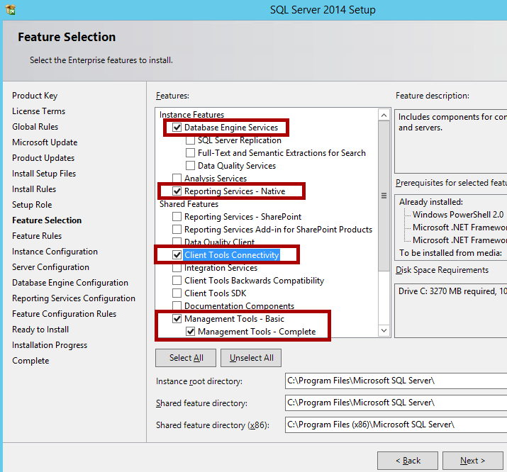

4. If you plan to use SSL for the Administration and Monitoring website, make sure that you configure SQL Server Reporting Services (SSRS) to use the Secure Sockets Layer (SSL) protocol before you configure the Administration and Monitoring website. Otherwise, the Reports feature will use unencrypted (HTTP) data transport instead of encrypted (HTTPS).

    You can follow [Configure SSL Connections](https://docs.microsoft.com/sql/reporting-services/security/configure-ssl-connections-on-a-native-mode-report-server?view=sql-server-2017) on a Native Mode Report Server to configure SSL on Report Server.
    
    > [!Note]
    > You can follow the SQL Server Installation Guide for your respective version of SQL Server to install SQL Server. The links are as follows:
        > * [SQL Server 2014](https://docs.microsoft.com/sql/sql-server/install/planning-a-sql-server-installation?view=sql-server-2014)
        > * [SQL Server 2012](https://docs.microsoft.com/previous-versions/sql/sql-server-2012/bb500442(v=sql.110))
        > * [SQL Server 2008 R2](https://docs.microsoft.com/previous-versions/sql/sql-server-2012/bb500442(v=sql.110))

5. In the post-installation of SQL Server, make sure that you provision the user account in SQL Server, and assign the following permissions to the user who will configure the MBAM database and reporting roles on the database server.

    Roles for the instance of SQL Server:
        
    * dbcreator
    * processadmin

    Rights for the instance of SQL Server Reporting Services:
    
    * Create Folders
    * Publish Reports

Your database server is ready for configuration of MBAM 2.5 roles. Let’s move to the next server.

#### Step 1.2: Deploying prerequisites for administration and monitoring server

Choose a server that meets the hardware configuration as explained in the [MBAM system requirements document](https://docs.microsoft.com/microsoft-desktop-optimization-pack/mbam-v25/mbam-25-supported-configurations#-mbam-server-system-requirements). It must be running Windows Server 2008 R2 or a later operating system together with latest service pack and updates. After the server is ready, install the following roles and features:

##### Roles

* Web Server (IIS) Management Tools (Select IIS Management Scripts and Tools.)

* Web Server Role Services

    * Common HTTP features 
      Static Content 
      Default Document

    * Application development 
      ASP.NET 
      .NET Extensibility 
      ISAPI Extensions 
      ISAPI Filters 
      Security 
      Windows Authentication 
      Request Filtering

    * Web Service IIS Management Tools

##### Feature

* .NET Framework 4.5 features
  
  * Microsoft .NET Framework 4.5
  
    For Windows Server 2012 or Windows Server 2012 R2, .NET Framework 4.5 is already installed for these versions of Windows Server. However, you must enable it.
  
    For Windows Server 2008 R2, .NET Framework 4.5 is not included with Windows Server 2008 R2. So, you must download .NET Framework 4.5 and install it separately.
  
  * WCF Activation 
    HTTP Activation 
    Non-HTTP Activation
  
  * TCP Activation
  
  * Windows Process Activation Service: 
    Process Model 
    .NET Framework Environment 
    Configuration APIs

For the self-service portal to work, you should also [download and install ASP.NET MVC 4.0](http://go.microsoft.com/fwlink/?linkid=392271).

The next step is to create the required MBAM users and groups in Active Directory.

### Step 2: Creating users and groups in Active Directory Domain Services
 
As part of the prerequisites, you must define certain roles and accounts that are used in MBAM to provide security and access rights to specific servers and features, such as the databases that are running on the instance of SQL Server and the web applications that are running on the Administration and Monitoring Server.

Create the following groups and users in Active Directory. (You can use any name for the groups and users.) Users do not have to have greater user rights. A domain user account is sufficient. You’ll have to specify the name of these groups during configuration of MBAM 2.5:

* **MBAMAppPool**  

  **Type**: Domain User

  **Description**: Domain user who has Read or Write permission to the Compliance and Audit Database and the Recovery Database to enable the web applications to access the data and reports in these databases. It will also be used by the application pool for the web applications.

  **Account Roles (During Configuration of MBAM)**:

  1. Web service application pool domain account

  2. Compliance and Audit Database and Recovery Database read/write user for reports

* **MBAMROUser**

  **Type**: Domain User

  **Description**: Domain user who will have Read-Only access to the Compliance and Audit Database to enable the reports to access the compliance and audit data in this database. It will also be the domain user account that the local SQL Server Reporting Services instance uses to access the Compliance and Audit Database.

  **Account Roles (During Configuration of MBAM)**:

  1. Compliance and Audit Database read-only user for reports

  2. Compliance and Audit Database domain user account

* **MBAMAdvHelpDsk**

  **Type**: Domain Group

  **Description**: MBAM Advanced Helpdesk Users access group: Domain user group whose members have access to all areas of the Administration and Monitoring Website. Users who have this role have to enter only the recovery key, not the user’s domain and user name, when they are helping users recover their drives. If a user is a member of both the MBAM Helpdesk Users group and the MBAM Advanced Helpdesk Users group, the MBAM Advanced Helpdesk Users group permissions override the MBAM Helpdesk Group permissions.

  **Account Roles (During Configuration of MBAM)**: MBAM Advanced Helpdesk Users

* **MBAMHelpDsk**

  **Type**: Domain Group

  **Description**: MBAM Helpdesk Users access group: Domain user group whose members have access to the Manage TPM and Drive Recovery areas of the MBAM Administration and Monitoring Website. People who have this role must fill in all fields when they use either option. This includes the user’s domain and account name.

  **Account Roles (During Configuration of MBAM)**: MBAM Helpdesk Users

* **MBAMRUGrp**

  **Type**: Domain Group

  **Description**: Domain user group whose members have read-only access to the reports in the Reports area of the Administration and Monitoring Website.

  **Account Roles (During Configuration of MBAM)**:

  1. Reports read-only domain access group

  2. MBAM Report Users access group

### Step 3 (Optional): Configure and install SSL certificate on administration and monitoring server

Although it’s optional, we highly recommend that you use a certificate to help secure the communication between the MBAM Client and the Administration and Monitoring Website and the Self-Service Portal websites. We do not recommend that you use self-signed certificates because of obvious security reasons. We suggest that you use a Web Server Type Certificate from a trusted Certification Authority. To do this, you can refer the "Using Certificate Approved by Certificate Authority" section from [KB 2754259](https://support.microsoft.com/help/2754259).

After the certificate is issued, you should add the certificate to the personal store of the Administration and Monitoring Server. To add the certificate, open the Certificates store on the local computer. To do this, follow these steps:

1. Right-select Start, and then select Run.

   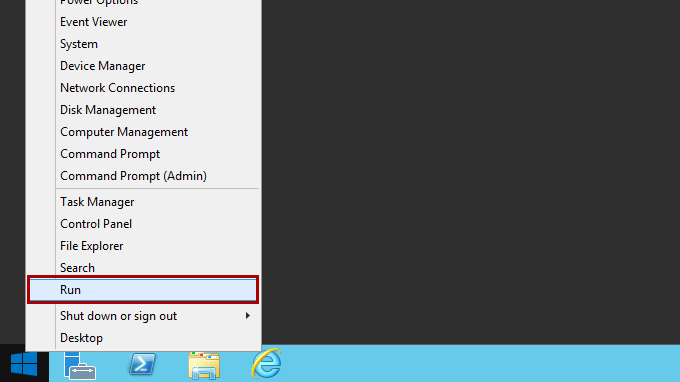

2. Type "MMC.EXE" (without the quotation marks), and then select **OK**.

   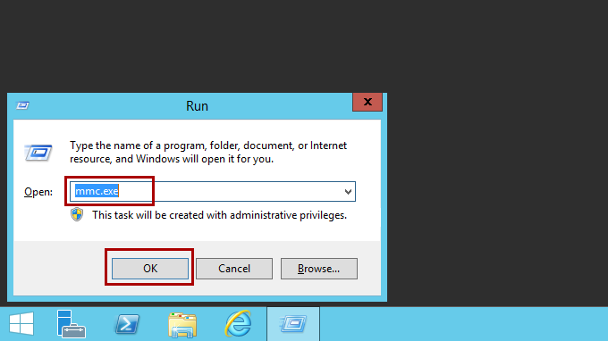 

3. Select **File** in the new MMC that you opened, and then select **Add/Remove Snap-in**.
   
   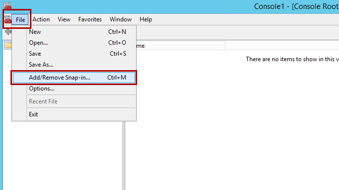

4. Highlight the **Certificates** snap-in, and then select **Add**.

   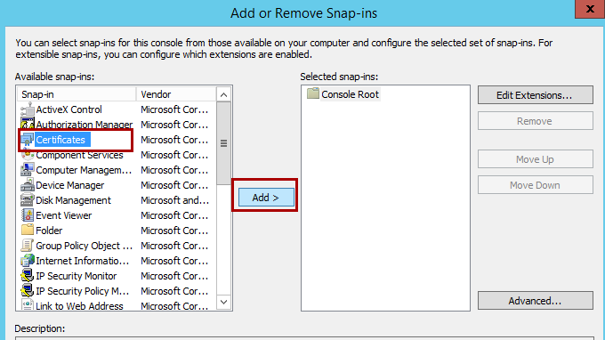

5. Select the **Computer account** option, and then select **Next**.
   
   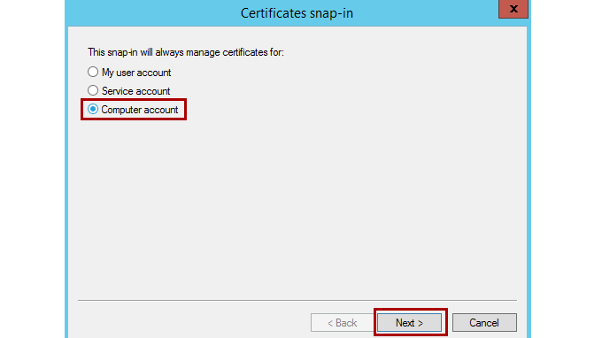

6. Select **Local Computer** on the next screen, and then select **Finish**.
   
   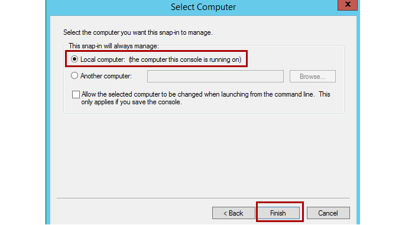

7. You have now added the Certificates snap-in. This will enable you to work with any certificates in your computer's certificate store.

   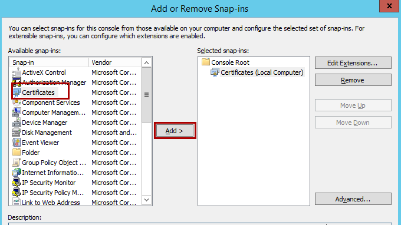

8. Import the web server certificate into your computer's certificate store.

   Now that you have access to the Certificates snap-in, you can import the web server certificate into your computer's certificate store. To do this, follow the next steps.

9. Open the Certificates (Local Computer) snap-in, and browse to **Personal** and then **Certificates**.
   
   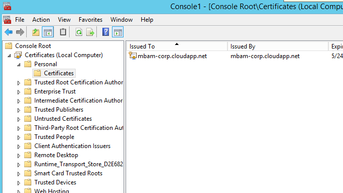

   > [!Note]
   > The Certificates snap-in may not be listed. If it is not, no certificates are installed.

10. Right-select **Certificates**, select **All Tasks**, and then select **Import**.

    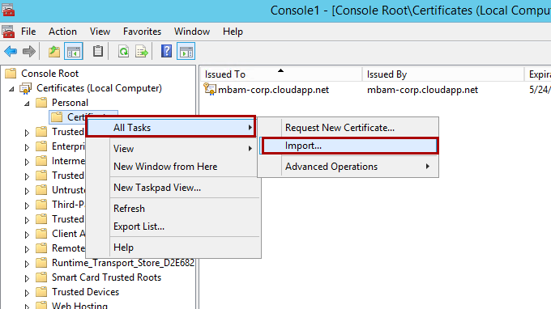

11. When the wizard starts, select **Next**. Browse to the file that you created that contains your server certificate and private key, and then select **Next**.

    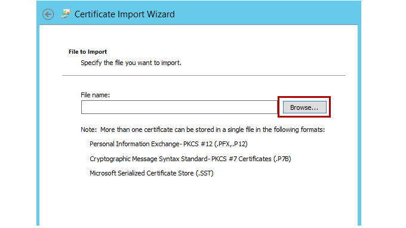

12. Enter the password if you specified one for the file when you created it.

   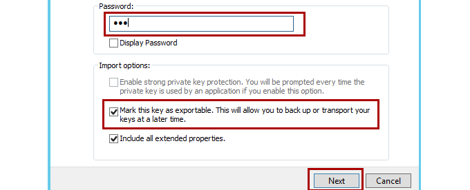

   > [!Note]
   > Make sure that the **Mark the key as exportable** option is selected if you want to be able to export the key pair again from this computer. As an added security measure, you may want to leave this option cleared to make sure that no one can make a backup of your private key.
 
13. Select **Next**, and then select the **Certificate Store** to which you want to save the certificate.

    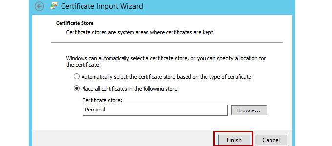

    > [!Note]
    > You should select **Personal**, because it is a web server certificate. If you included the certificate in the certification hierarchy, it will also be added to this store.
 
14. Select **Next**, and then select **Finish**.

    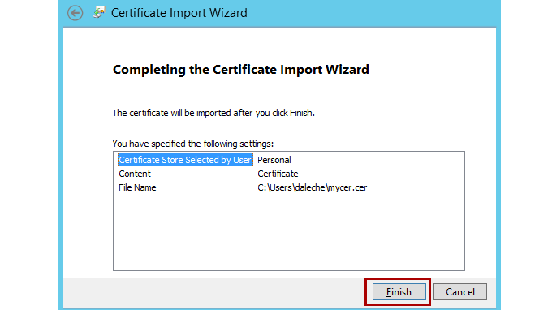

You will now see the server certificate for your web server in the Personal Certificates list. It will be denoted by the common name of the server. (You can find this in the subject section of the certificate.)

For further reference:

[MBAM 2.5 Security Considerations](https://docs.microsoft.com/microsoft-desktop-optimization-pack/mbam-v25/mbam-25-security-considerations)

[Planning How to Secure the MBAM Websites](https://docs.microsoft.com/microsoft-desktop-optimization-pack/mbam-v25/planning-how-to-secure-the-mbam-websites)

The next step is to register a service principle name for the application pool account.

### Step 4: Configuring SSL certificate for MBAM Web Server

If you are using SSL communication between the client and server, you should make sure that the certificate has Enhanced Key Usage OIDs (1.3.6.1.5.5.7.3.1) and (1.3.6.1.5.5.7.3.2). That is, you should make sure that Server Authentication and Client Authentication are added.

If you receive a certificate error when you try to browse service URLs, you are using a certificate that was issued to a different name, or you are browsing by using an incorrect URL.

Although the browser may prompt you with a certificate error message but let you continue, the MBAM web service will not ignore certificate errors and will block the connection. You will notice certificate-related errors in the MBAM client’s MBAM Admin event log. If you are using an alias to connect to the Administration and Monitoring server, you should issue a certificate to the alias name. That is, the subject name of the certificate should be the alias name, and the local server’s DNS name should be added to the **Subject Alternative Name** field of the certificate.

Example:

If the virtual name is "bitlocker.contoso.com" and the MBAM Administration and Monitoring server name is "adminserver.contoso.com," the certificate should be issued to bitlocker.contoso.com (subject name), and adminserver.contoso.com should be added to **Subject Alternative Name** field of the certificate.

Similarly, if you have multiple Administration and Monitoring servers installed to balance the load by using a load balancer, you should issue the SSL certificate to the virtual name. That is, the subject name field of the certificate should have the virtual name, and the names of all the local servers should be added in the **Subject Alternative Name** field of the certificate.

Example:

If the virtual name is "bitlocker.contoso.com" and the servers are "adminserver1.contoso.com" and "adminiserver2.contoso.com," the certificate should be issued to bitlocker.contoso.com (subject name) and adminserver1.contoso.com, and adminiserver2.contoso.com should be added to the **Subject Alternative Name** field of the certificate.

The steps to configure SSL communication by using MBAM are described in the following Knowledge Base article: [KB 2754259](https://support.microsoft.com/help/2754259).

### Step 5: Register SPNS for the application pool account and configure constrained delegation

> [!Note]
> Constrained delegation is required only for 2.5 and is not required for 2.5 Service Pack 1 and later.

To enable the MBAM servers to authenticate communication from the Administration and Monitoring Website and the Self-Service Portal, you must register a Service Principal Name (SPN) for the host name under the domain account that you are using for the web application pool. The following article contains step-by-step instructions to register SPNs: [Planning How to Secure the MBAM Websites](https://docs.microsoft.com/microsoft-desktop-optimization-pack/mbam-v25/planning-how-to-secure-the-mbam-websites)

After you have the SPN configured, you should set up constrained delegation on the SPN. To do this, follow these steps:

1. Go to Active Directory, and find the app pool credentials that you configured for MBAM websites in the previous steps.

2. Right-click the credentials, and then select **properties**.

3. Select the **delegation** tab.

4. Select the option for Kerberos authentication.

5. Select **browse**, and browse again for your app pool credentials. You should then see the all the SPNs that are set up on the app pool creds account. (The SPN should resemble "http/bitlocker.fqdn.com"). Highlight the SPN that is the same as the host name that you specified during the MBAM installation.

6. Select **OK**.

Now you are good with prerequisites. In the next steps, you will install the MBAM software on the servers and configure it.

## Installing and configuring MBAM 2.5 server software

### Step 6: Install MBAM 2.5 server software 

To install the MBAM Server software by using the Microsoft BitLocker Administration and Monitoring Setup wizard both on Database Server and on Administration and Monitoring Server, follow these steps.

1. On the server on which you want to install MBAM, run MBAMserversetup.exe to start the Microsoft BitLocker Administration and Monitoring Setup wizard.

2. On the Welcome page, select **Next**.

3. Read and accept the Microsoft Software License Agreement, and then select **Next** to continue the installation.

4. Decide whether to use Microsoft Update when you check for updates, and then select **Next**.

5. Decide whether to participate in the Customer Experience Improvement Program, and then select **Next**.

6. To start the installation, select **Install**.

7. To configure the server features after the MBAM Server software finishes installing, select the **Run MBAM Server Configuration after the wizard closes** check box. Or, you can configure MBAM later by using the **MBAM Server Configuration** shortcut that the server installation creates on your **Start** menu.

8. Select **Finish**.

For more information, see [Installing the MBAM 2.5 Server Software](https://docs.microsoft.com/microsoft-desktop-optimization-pack/mbam-v25/installing-the-mbam-25-server-software).

### Step 7: Configure MBAM 2.5 database and reports role

In this step, we will configure the MBAM 2.5 databases and reporting component by using the MBAM Wizard:

1. Configure the Compliance and Audit Database and the Recovery Database by using the wizard:
   
   1. On the server on which you want to configure the databases, start the **MBAM Server Configuration wizard**. You can select **MBAM Server Configuration** on the **Start** menu to open the wizard.

   2. Select **Add New Features**, select **Compliance and Audit Database**, **Recovery Database and Reports**, and then select **Next**. The wizard checks that all prerequisites for the databases are met.

   3. If the prerequisite check is successful, select **Next** to continue. Otherwise, resolve any missing prerequisites, and then select **Check prerequisites again**.
   
   4. Using the following descriptions, enter the field values in the wizard:

2. Compliance and audit database

   |Field	|Description|
   |-------|-------|
   |SQL Server name	|Name of the server on which you are configuring the Compliance and Audit Database.   You must add an exception on the Compliance and Audit Database computer to enable incoming inbound traffic on the SQL Server port. The default port number is 1433.|
   |SQL Server database instance	|Name of the database instance where the compliance and audit data will be stored. If you are using the default instance, you must leave this field blank. You must also specify where the database information will be located.|
   |Database name	|Name of the database that will store the compliance data. You must note the name of the database that you are specifying here because you will have to provide this information in later steps.|
   |Read/write permission domain user or group	|Specify the name of the MBAMAppPool user as configured in step 2.|
   |Read-only access domain user or group	|Specify the name of the MBAMROUser user as configured in step 2.|

3. Recovery database.

   |Field	|Description|
   |-----|-----|
   |SQL Server name	|Name of the server on which you are configuring the Recovery Database. You must add an exception on the Recovery Database computer to enable incoming inbound traffic on the SQL Server port. The default port number is 1433.|
   |SQL Server database instance	|Name of the database instance where the recovery data will be stored. If you are using the default instance, you must leave this field blank. You must also specify where the database information will be located.|
   |Database name	|Name of the database that will store the recovery data.|
   |Read/write permission domain user or group	|Domain user or group that has read/write permission to this database to enable the web applications to access the data and reports in this database.  If you enter a user in this field, it must be the same value as the value in the **Web service application pool domain account** field on the **Configure Web Applications** page.  If you enter a group in this field, the value in the **Web service application pool domain account** field on the **Configure Web Applications** page must be a member of the group that you enter in this field.|
   
   When you finish your entries, select **Next**. The wizard checks that all prerequisites for the databases are met.
   
   If the prerequisite check is successful, select **Next** to continue. Otherwise, resolve any missing prerequisites, and then select **Next** again.

4. Reports.

   |Field	|Description|
   |----|----|
   |SQL Server Reporting Services instance	|Instance of SQL Server Reporting Services where the reports will be configured. If you are using the default instance, you must leave this field blank.|
   |Reporting role domain group	|Specify the name of the MBAMRUGrp as mentioned in step 2.|
   |SQL Server name	|Name of the server on which the Compliance and Audit Database is configured.|
   |SQL Server database instance	|Name of the database instance where the compliance and audit data is configured. If you are using the default instance, you must leave this field blank.  You must add an exception on the Reports computer to enable incoming traffic on the port of the Reporting Server. (The default port is 80.)|
   |Database name|	Name of the Compliance and Audit Database. By default, the database name is MBAM Compliance Status.|
   |Compliance and Audit Database domain account	|Specify the name of the MBAMROUser user as configured in step 2.|
   
   When you finish your entries, select **Next**. The wizard checks that all prerequisites for the Reports feature are met. Select Next to continue. On the **Summary** page, review the features that will be added.
   
   For more information, see the following article: [How to Configure the MBAM 2.5 Databases](https://docs.microsoft.com/microsoft-desktop-optimization-pack/mbam-v25/how-to-configure-the-mbam-25-databases).

### Step 8: Configure the MBAM 2.5 Web applications role

1. On the server on which you want to configure the web applications, start the MBAM Server Configuration wizard. You can select **MBAM Server Configuration** on the **Start** menu to open the wizard.

2. Select **Add New Features**, select **Administration and Monitoring Website** and **Self-Service Portal**, and then select **Next**. The wizard checks that all prerequisites for the databases are met.

3. If the prerequisite check is successful, select **Next** to continue. Otherwise, resolve any missing prerequisites, and then select **Check prerequisites again**.

4. Use the following descriptions to enter the field values in the wizard.

   |Field	|Description|
   |-----|-----|
   |Security certificate	|Select a previously created certificate in step 3 to optionally encrypt the communication between the web services and the server on which you are configuring the Administration and Monitoring Website. If you select Do not use a certificate, your web communication may not be secure.|
   |Host name	|Name of the host computer on which you are configuring the Administration and Monitoring Website.  It does not have to be the hostname of the machine, it could be anything. However, if the hostname is different than the netbios name of the computer, you have to create an A record and make sure the SPN uses the custom hostname, not the netbios name. This is common on load balancing scenarios.|
   |Installation path	|Path on which you are installing the Administration and Monitoring Website.|
   |Port	|Port number to use for website communication.   You must set a firewall exception to enable communication through the specified port.|
   |Web service application pool domain account and password	|Specify the user account and password of the MBAMAppPool user as configured in step 2.   For improved security, set the account that is specified in the credentials to have limited user rights. Also, set the password of the account to never expire.|

5. Verify that the built-in IIS_IUSRS account or the application pool account was added to the **Impersonate a client after authentication** and the **Log on as a batch job** local security settings.

   To check whether the account was added to the local security settings, open the **Local Security Policy editor**, expand the **Local Policies** node, select the **User Rights Assignment** node, and double-select **Impersonate a client after authentication** and **Log on as a batch job** policies in the right-side pane.

6. Use the following field descriptions to configure the connection information in the wizard for the Compliance and Audit Database.
   |Field	|Description|
   |------|------|
   |SQL Server name	|Name of the server on which the Compliance and Audit Database is configured.|
   |SQL Server database instance	|Name of the instance of SQL Server (for example, \<Server Name\>) and on which the Compliance and Audit Database is configured. Leave this blank if you are using the default instance.|
   |Database name	|Name of the Compliance and Audit Database. By default, it’s "MBAM Compliance Status".|

7. Use the following field descriptions to configure the connection information in the wizard for the Recovery Database.
   |Field	|Description|
   |----|----|
   |SQL Server name	|Name of the server on which the Recovery Database is configured.|
   |SQL Server database instance	|Name of the instance of SQL Server (for example, \<Server Name\>) on which the Recovery Database is configured. Leave this blank if you are using the default instance.|
   |Database name	|Name of the Recovery Database. By default, it’s "MBAM Recovery and Hardware".|

8. Use the following descriptions to enter the field values in the wizard to configure the Administration and Monitoring Website.
   |Field	|Description|
   |----|----|
   |Advanced Helpdesk role domain group	|Specify the name of the MBAMAdvHelpDsk Group as configured in step 2.|
   |Helpdesk role domain group	|Specify the name of the MBAMHelpDsk Group as configured in step 2.|
   |Use System Center Configuration Manager Integration	|Select to clear this check box.	 |
   |Reporting role domain group	|Specify the name of the MBAMRUGrp Group as configured in step 2.	 |
   |SQL Server Reporting Services URL	|Specify the Web Service URL for the SSRS server on which the MBAM reports are configured. You can find this information by logging in to Reporting Services Configuration Manager on the Database Server.   Example of a fully qualified domain name: https://MyReportServer.Contoso.com/ReportServer  Example of a custom host name: https://MyReportServer/ReportServer|
   |Virtual directory	|Virtual directory of the Administration and Monitoring Website. This name corresponds to the website’s physical directory on the server and is appended to the website’s host name. For example:  http(s)://*\<host name\>*:*\<port\>*/HelpDesk/  If you do not specify a virtual directory, the value HelpDesk will be used.	 |

9. Use the following description to enter the field values in the wizard to configure the Self-Service Portal.

   |Field	|Description|
   |----|----|
   |Virtual directory	|Virtual directory of the web application. This name corresponds to the website’s physical directory on the server and is appended to the website’s host name. For example: http(s)://*\<host name\>*:*\<port\>*/SelfService/  If you do not specify a virtual directory, the value "SelfService" will be used.|

10. When you finish your entries, select **Next**. The wizard checks that all prerequisites for the web applications are met.

11. Select **Next** to continue.

12. On the **Summary** page, review the features that will be added.

13. Select **Add** to add the web applications to the server, and then select **Close**.

## Customizing and validating steps after installing MBAM 2.5 server software

### Step 9: Customizing the self-server portal for your organization

To customize the Self-Service Portal by adding custom notice text, your company name, pointers to more information, and so on, see [Customizing the Self-Service Portal for Your Organization](https://docs.microsoft.com/microsoft-desktop-optimization-pack/mbam-v25/customizing-the-self-service-portal-for-your-organization).
 
### Step 10: Configure the self-server portal if client computers cannot access the CDN 

Determine whether your client computers have access to the Microsoft AJAX Content Delivery Network (CDN). The CDN gives the Self-Service Portal the access it requires to certain JavaScript files. If you don’t configure the Self-Service Portal when client computers cannot access the CDN, only the company name and the account under which the user signed in will be displayed. No error message will be shown.

Do one of the following:

* If your client computers have access to the CDN, do nothing. Your Self-Service Portal configuration is complete.

* If your client computers do not have access to the CDN, follow the steps in [How to Configure the Self-Service Portal When Client Computers Cannot Access the Microsoft Content Delivery Network](https://docs.microsoft.com/microsoft-desktop-optimization-pack/mbam-v25/how-to-configure-the-self-service-portal-when-client-computers-cannot-access-the-microsoft-content-delivery-network).

### Step 11: Validate the MBAM 2.5 server feature configuration 

To validate your MBAM Server deployment to use the standalone topology, follow these steps.

1. On each server on which an MBAM feature is deployed, select **Control Panel** > **Programs** > **Programs and Features**. Verify that **Microsoft BitLocker Administration and Monitoring** appears in the **Programs and Features** list.
   > [!Note]
   > To perform the validation, you must use a domain account that has local computer administrative credentials on each server.

2. On the server on which the Recovery Database is configured, open SQL Server Management Studio, and verify that the **MBAM Recovery and Hardware** database is configured.

3. On the server om which the Compliance and Audit Database is configured, open SQL Server Management Studio, and verify that the MBAM Compliance Status Database is configured.

4. On the server onm which the Reports feature is configured, open a web browser by using administrative credentials, and browse to the homepage of the SQL Server Reporting Services site.
   
   The default homepage location of a SQL Server Reporting Services site instance is as follows:
   http(s)://*\<MBAM Reports Server Name\>*:*\<port\>*/Reports.aspx
   
   To find the actual URL, use the Reporting Services Configuration Manager tool, and select the instances that you specified during setup.
   
5. Verify that a reports folder that is named Microsoft BitLocker Administration and Monitoring contains a data source that is named MaltaDataSource. This data source contains folders that have names that represent language locales (for example, en-us). The reports are in the language folders.

   > [!Note]
   > If SQL Server Reporting Services (SSRS) was configured as a named instance, the URL should resemble the following:
   > http(s)://\<MBAM Reports Server Name\>:\<port\>/Reports_\<SSRS Instance Name\>
   >
   > If SSRS was not configured to use Secure Socket Layer (SSL), the URL for the reports will be set to "HTTP" instead of "HTTPS" when you install the MBAM server. If you then go to the Administration and Monitoring Website (also known as Helpdesk) and select a report, you receive the following message: "Only Secure Content is Displayed." To show the report, select **Show All Content**.

6. On the server on which the Administration and Monitoring Website feature is configured, run Server Manager, browse to **Roles**, and then select **Web Server (IIS)** > **Internet Information Services (IIS)** Manager.

7. In **Connections**, browse to \<computer name\> and then select **Sites** > **Microsoft BitLocker Administration and Monitoring**. Verify that the following are listed:

   * MBAMAdministrationService
   * MBAMComplianceStatusService
   * MBAMRecoveryAndHardwareService

8. On the server on which the Administration and Monitoring Website and Self-Service Portal are configured, open a web browser by using administrative credentials.

9. Browse to the following websites to verify that they load successfully:
   * https(s)://\<MBAM Administration Server Name\>:\<port\>/HelpDesk/ (confirm each link for navigation and reports)
   * http(s)://\<MBAM Administration Server Name\>:\<port\>/SelfService/

   > [!Note]
   > It is assumed that you configured the server features on the default port without network encryption. If you configured the server features on a different port or virtual directory, change the URLs to include the appropriate port. For example:
   > http(s)://\<host name\>:\<port\>/HelpDesk/
   > http(s)://\<host name\>:\<port\>/\<virtualdirectory\>/
   > If the server features were configured to use network encryption, change http:// to https://.
   
10. Browse to the following web services to verify that they load successfully. A page opens to indicate that the service is running. However, the page displays no metadata.

    * http(s)://\<MBAM Administration Server Name>:\<port>/MBAMAdministrationService/AdministrationService.svc
    * http(s)://\<MBAM Administration Server Name>:\<port>/MBAMUserSupportService/UserSupportService.svc
    * http(s)://\<MBAM Administration Server Name>:\<port>/MBAMComplianceStatusService/StatusReportingService.svc
    * http(s)://\<MBAM Administration Server Name>:\<port>/MBAMRecoveryAndHardwareService/CoreService.svc

### Step 12: Configure the MBAM Group policy templates

To deploy MBAM, you have to set Group Policy settings that define MBAM implementation settings for BitLocker Drive Encryption. To complete this task, you must copy the MBAM Group Policy templates to a server or workstation that can run Group Policy Management Console (GPMC) or Advanced Group Policy Management (AGPM), and then edit the settings.

> [!Important]
> Do not change the Group Policy settings in the **BitLocker Drive Encryption** node or MBAM will not work correctly. When you configure the Group Policy settings in the **MDOP MBAM (BitLocker Management)** node, MBAM automatically configures the **BitLocker Drive Encryption** settings for you.
 
#### Copying the MBAM 2.5 Group Policy templates

Before you install the MBAM Client, you must copy MBAM-specific Group Policy Objects (GPOs) to the management workstation. These GPOs define MBAM implementation settings for BitLocker. You can copy the Group Policy templates to any server or workstation that is a supported Windows-based server or client computer and that can run the Group Policy Management Console (GPMC) or Advanced Group Policy Management (AGPM).

For more information, see [Copying the MBAM 2.5 Group Policy Templates](https://docs.microsoft.com/microsoft-desktop-optimization-pack/mbam-v25/copying-the-mbam-25-group-policy-templates).
 
#### Editing MBAM 2.5 GPO settings

After you create the necessary GPOs, you must deploy the MBAM Group Policy settings to your organization’s client computers. To view and create GPOs, you must have Group Policy Management Console (GPMC) or Advanced Group Policy Management (AGPM) installed.

For more information, see [Editing the MBAM 2.5 Group Policy Settings](https://docs.microsoft.com/microsoft-desktop-optimization-pack/mbam-v25/editing-the-mbam-25-group-policy-settings) and [Planning for MBAM 2.5 Group Policy Requirements](https://docs.microsoft.com/microsoft-desktop-optimization-pack/mbam-v25/planning-for-mbam-25-group-policy-requirements).
 
### Step 13: Deploying the MBAM 2.5 Client

Depending on when you deploy the Microsoft BitLocker Administration and Monitoring Client software, you can enable BitLocker on a computer in your organization either before the user receives the computer or afterward by configuring Group Policy and deploying the MBAM Client software by using an enterprise software deployment system.
 
#### Deploy the MBAM Client to desktop or portable computers

After you configure Group Policy settings, you can use an enterprise software deployment system product such as Microsoft System Center 2012 Configuration Manager or Active Directory Domain Services (AD DS) to deploy the MBAM client installation Windows Installer files to target computers. You can use either the 32-bit or 64-bit MbamClientSetup.exe files or the 32-bit or 64-bit MBAMClient.msi files. These are provided together with the MBAM Client software.

For more information, see [How to Deploy the MBAM Client to Desktop or Laptop Computers](https://docs.microsoft.com/microsoft-desktop-optimization-pack/mbam-v25/how-to-deploy-the-mbam-client-to-desktop-or-laptop-computers-mbam-25).
 
#### Deploy the MBAM Client as part of a Windows deployment

In organizations in which computers are received and configured centrally, you can install the MBAM Client to manage BitLocker Drive Encryption on each computer before any user data is written to it. The benefit of this process is that every computer is then BitLocker-compliant. This method does not rely on user action because the administrator has already encrypted the computer. A key assumption for this scenario is that the policy of the organization is to install a corporate Windows image before the computer is delivered to the user. If the Group Policy settings are configured to require a PIN, users are prompted to set a PIN after they receive the policy.

For more information, see [How to Deploy the MBAM Client as Part of a Windows Deployment](https://docs.microsoft.com/microsoft-desktop-optimization-pack/mbam-v25/how-to-enable-bitlocker-by-using-mbam-as-part-of-a-windows-deploymentmbam-25).
 
#### How to deploy the MBAM Client by using a command line

For more information see [How to Deploy the MBAM Client by Using a Command Line](https://docs.microsoft.com/microsoft-desktop-optimization-pack/mbam-v25/how-to-deploy-the-mbam-client-by-using-a-command-line).

#### Post-deployment of clients

Now that you have finished the deployment activity, you should review the following logs and determine whether the clients are reporting successfully to the MBAM database.

## FAQ

### How to create a Load balanced IIS servers

* SPN must be registered only to the friendly name (for example: bitlocker.corp.net), and must not be registered to individual IIS servers.

* If a certificate is used, the certificate must have both FQDN and NetBIOS names entered into the **Subject Alternative Name** field for all IIS servers in the load balance group and also as the Friendly Name (for example: bitlocker.corp.net). Otherwise, the certificate will be reported as not trusted by the browser when you browse load-balanced addresses.

For more information, see [IIS Network Load Balancing](https://docs.microsoft.com/microsoft-desktop-optimization-pack/mbam-v25/planning-for-mbam-25-high-availability#a-href-idbkmk-load-balanceaiis-network-load-balancing) and [Registering SPNs for the application pool account](https://docs.microsoft.com/microsoft-desktop-optimization-pack/mbam-v25/planning-how-to-secure-the-mbam-websites#registering-spns-for-the-application-pool-account).

### How to configure a certificate

* You’ll have to have two certificates. One certificate is used for SQL server, and the other is used for IIS. They must be installed before starting MBAM installation.

* We recommend that you use the installer to add the certificate to the IIS configuration instead of manually editing the web.config file.

* The certificate will not be accepted by the MBAM Configurator if the “Issued To” field on the certificate does not match the name of the server. In this case, temporarily create a self-signed certificate from the IIS Console, and use it in the Configurator. This will make nsure that the Web Apps are installed for SSL and HTTPS. After that, you can change the certificate to one from IIS bindings for the MBAM Website.

### The SQL permissions requirement for installation

Create an account for MBAM App Pool, and give it only SecurityAdmin, Public, and DBCreator permissions.

See [MBAM Database configuration – minimum permissions](https://blogs.technet.microsoft.com/dubaisec/2016/02/02/mbam-database-configuration-minimum-permissions/) for more information.

> [!Note]
> * In some situations, more permissions are required for the initial installation and upgrade operations.
> * Use an account that has temporary SA for the installation.
> * Do not start the Configurator in the context of a user account (Run As) that does not have enough permissions to make changes to SQL Server because this will cause installation errors.
> * You must be logged on by using an account that has permissions on SQL Server. Only SQL Server databases can be created or updated by running MBAM Configurator remotely. For SSRS server, you must install MBAM and run Configurator locally to install or update the MBAM SSRS reports.

### The permission required for SPN Registration

An account that's used for IIS portal installation must have Write ServicePrincipalName and Write Validated SPN permissions. Without these permissions, the installation will return a warning message that states that it cannot register the SPN.

> [!Note]
> You will this receive this warning message twice. This does not mean that the SPN must have two objects registered to it.

For more information, see [MBAM Setup fails with “Register SPN Deferred” error message](https://support.microsoft.com/help/2754138/).

### Did I have to update the ADMX templates to the latest version?

You'll see multiple OS options in the MBAM root node for GPO after you update the ADMX templates to their latest versions. For example, Windows 7, Windows 8.1, and Windows 10, version 1511 and later versions.

For more information about how to update the ADMX templates, see the following articles:
* [How to Download and Deploy MDOP Group Policy (.admx) Templates](https://docs.microsoft.com/microsoft-desktop-optimization-pack/solutions/how-to-download-and-deploy-mdop-group-policy--admx--templates)
* [Planning for MBAM 2.5 Group Policy Requirements](https://docs.microsoft.com/microsoft-desktop-optimization-pack/mbam-v25/planning-for-mbam-25-group-policy-requirements)
* [Microsoft Desktop Optimization Pack Group Policy Administrative Templates](https://www.microsoft.com/en-us/download/details.aspx?id=55531)
