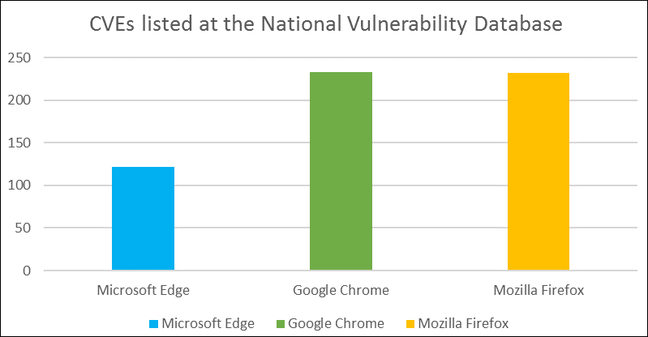
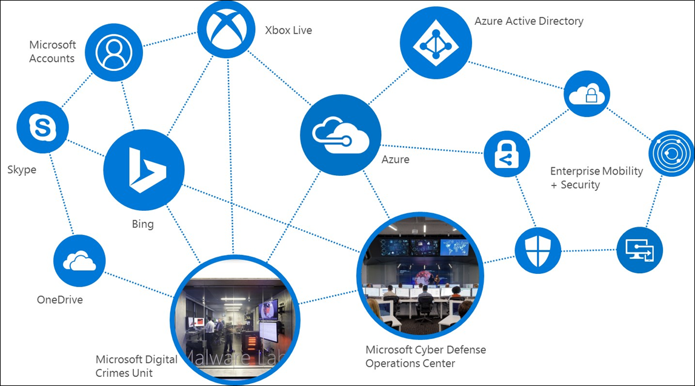
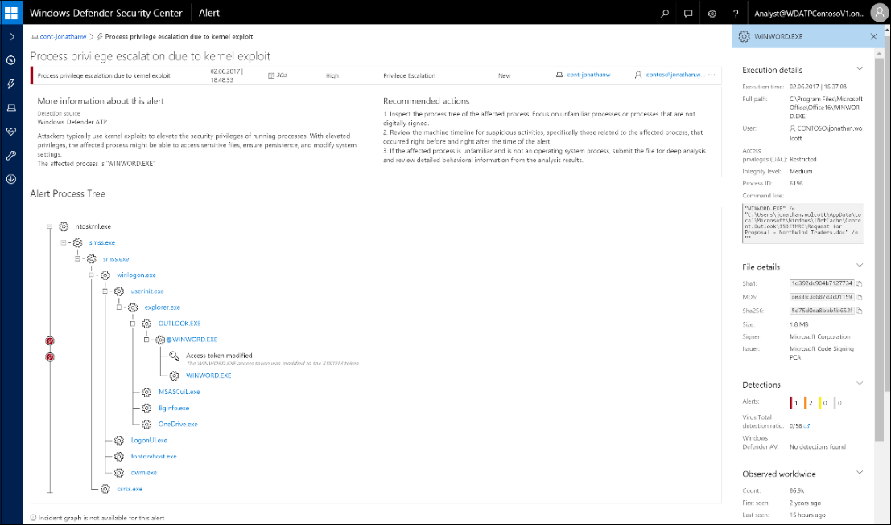
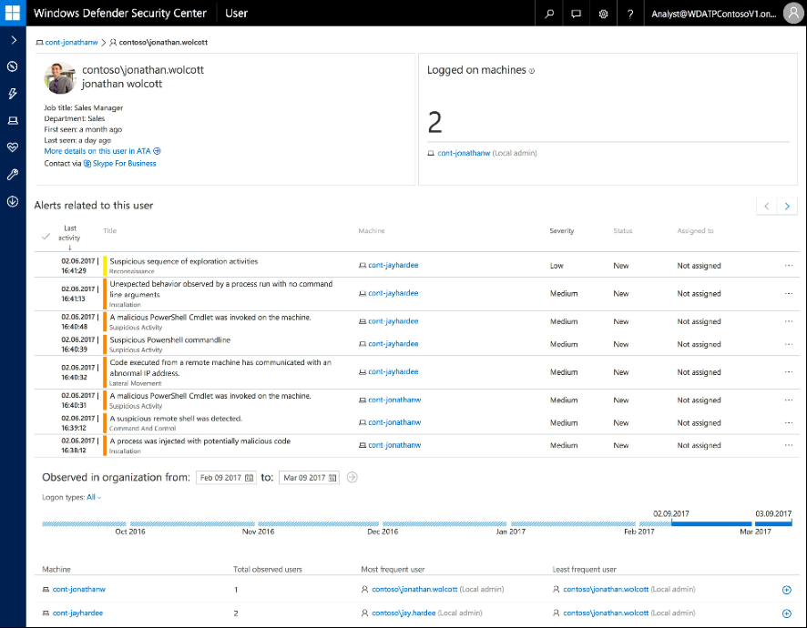
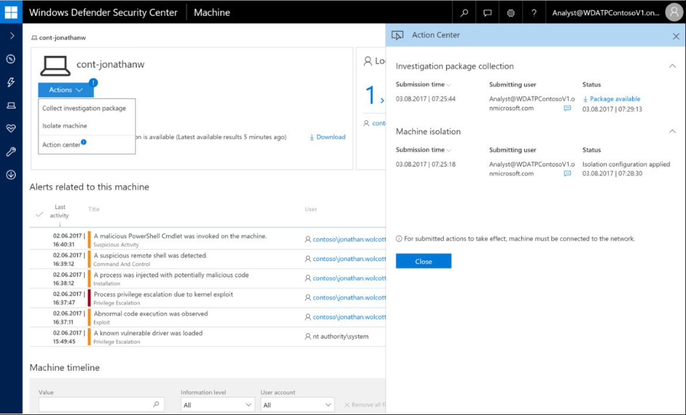
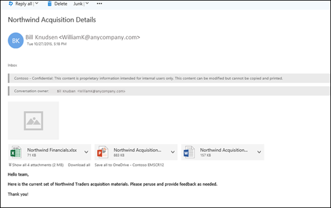

# Beginning your General Data Protection Regulation (GDPR) journey for Windows 10

This article provides info about the GDPR, including what it is, and the products Microsoft provides to help you to become compliant.

## Introduction
On May 25, 2018, a European privacy law is due to take effect that sets a new global bar for privacy rights, security, and compliance.

The General Data Protection Regulation, or GDPR, is fundamentally about protecting and enabling the privacy rights of individuals. The GDPR establishes strict global privacy requirements governing how you manage and protect personal data while respecting individual choice — no matter where data is sent, processed, or stored.

Microsoft and our customers are now on a journey to achieve the privacy goals of the GDPR. At Microsoft, we believe privacy is a fundamental right, and we believe that the GDPR is an important step forward for clarifying and enabling individual privacy rights. But we also recognize that the GDPR will require significant changes by organizations all over the world.

We have outlined our commitment to the GDPR and how we are supporting our customers within the [Get GDPR compliant with the Microsoft Cloud](https://blogs.microsoft.com/on-the-issues/2017/02/15/get-gdpr-compliant-with-the-microsoft-cloud/#hv52B68OZTwhUj2c.99) blog post by our Chief Privacy Officer [Brendon Lynch](https://blogs.microsoft.com/on-the-issues/author/brendonlynch/) and the [Earning your trust with contractual commitments to the General Data Protection Regulation](https://blogs.microsoft.com/on-the-issues/2017/04/17/earning-trust-contractual-commitments-general-data-protection-regulation/#6QbqoGWXCLavGM63.99)” blog post by [Rich Sauer](https://blogs.microsoft.com/on-the-issues/author/rsauer/) - Microsoft Corporate Vice President & Deputy General Counsel.

Although your journey to GDPR-compliance may seem challenging, we're here to help you. For specific information about the GDPR, our commitments and how to begin your journey, please visit the [GDPR section of the Microsoft Trust Center](https://www.microsoft.com/trustcenter/privacy/gdpr).

## GDPR and its implications
The GDPR is a complex regulation that may require significant changes in how you gather, use and manage personal data. Microsoft has a long history of helping our customers comply with complex regulations, and when it comes to preparing for the GDPR, we are your partner on this journey.

The GDPR imposes rules on organizations that offer goods and services to people in the European Union (EU), or that collect and analyze data tied to EU residents, no matter where those businesses are located. Among the key elements of the GDPR are the following:

- **Enhanced personal privacy rights.** Strengthened data protection for residents of EU by ensuring they have the right to access to their personal data, to correct inaccuracies in that data, to erase that data, to object to processing of their personal data, and to move it.

- **Increased duty for protecting personal data.** Reinforced accountability of organizations that process personal data, providing increased clarity of responsibility in ensuring compliance.

- **Mandatory personal data breach reporting.** Organizations that control personal data are required to report personal data breaches that pose a risk to the rights and freedoms of individuals to their supervisory authorities without undue delay, and, where feasible, no later than 72 hours once they become aware of the breach.

As you might anticipate, the GDPR can have a significant impact on your business, potentially requiring you to update privacy policies, implement and strengthen data protection controls and breach notification procedures, deploy highly transparent policies, and further invest in IT and training. Microsoft Windows 10 can help you effectively and efficiently address some of these requirements.

## Personal and sensitive data
As part of your effort to comply with the GDPR, you will need to understand how the regulation defines personal and sensitive data and how those definitions relate to data held by your organization.

The GDPR considers personal data to be any information related to an identified or identifiable natural person. That can include both direct identification (such as, your legal name) and indirect identification (such as, specific information that makes it clear it is you the data references). The GDPR also makes clear that the concept of personal data includes online identifiers (such as, IP addresses, mobile device IDs) and location data.

The GDPR introduces specific definitions for genetic data (such as, an individual’s gene sequence) and biometric data. Genetic data and biometric data along with other sub categories of personal data (personal data revealing racial or ethnic origin, political opinions, religious or philosophical beliefs, or trade union membership: data concerning health; or data concerning a person’s sex life or sexual orientation) are treated as sensitive personal data under the GDPR. Sensitive personal data is afforded enhanced protections and generally requires an individual’s explicit consent where these data are to be processed.

### Examples of info relating to an identified or identifiable natural person (data subject)
This list provides examples of several types of info that will be regulated through GDPR. This is not an exhaustive list.

- 	Name

- 	Identification number (such as, SSN)

- 	Location data (such as, home address)

- 	Online identifier (such as, e-mail address, screen names, IP address, device IDs)

- 	Pseudonymous data (such as, using a key to identify individuals)

- 	Genetic data (such as, biological samples from an individual)

- 	Biometric data (such as, fingerprints, facial recognition)

## Getting started on the journey towards GDPR compliance
Given how much is involved to become GDPR-compliant, we strongly recommend that you don't wait to prepare until enforcement begins. You should review your privacy and data management practices now. We recommend that you begin your journey to GDPR compliance by focusing on four key steps:

- 	**Discover.** Identify what personal data you have and where it resides. 

- 	**Manage.** Govern how personal data is used and accessed.

- 	**Protect.** Establish security controls to prevent, detect, and respond to vulnerabilities and data breaches.	

- 	**Report.** Act on data requests, report data breaches, and keep required documentation.

    

For each of the steps, we've outlined example tools, resources, and features in various Microsoft solutions, which can be used to help you address the requirements of that step. While this article isn't a comprehensive “how to,” we've included links for you to find out more details, and more information is available in the [GDPR section of the Microsoft Trust Center](https://www.microsoft.com/trustcenter/privacy/gdpr).

## Windows 10 security and privacy
As you work to comply with the GDPR, understanding the role of your desktop and laptop client machines in creating, accessing, processing, storing and managing data that may qualify as personal and potentially sensitive data under the GDPR is important. Windows 10 provides capabilities that will help you comply with the GDPR requirements to implement appropriate technical and organizational security measures to protect personal data.

With Windows 10, your ability to protect, detect and defend against the types of attacks that can lead to data breaches is greatly improved. Given the stringent requirements around breach notification within the GDPR, ensuring that your desktop and laptop systems are well defended will lower the risks you face that could result in costly breach analysis and notification.

In this section, we'll talk about how Windows 10 provides capabilities that fit squarely in the **Protect** stage of your journey, including these 4 scenarios:

- **Threat protection: Pre-breach threat resistance.** Disrupt the malware and hacking industry by moving the playing field to one where they lose the attack vectors that they depend on.

- **Threat protection: Post-breach detection and response.** Detect, investigate, and respond to advanced threats and data breaches on your networks.

- **Identity protection.** Next generation technology to help protect your user’s identities from abuse.

- **Information protection.** Comprehensive data protection while meeting compliance requirements and maintaining user productivity.

These capabilities, discussed in more detail below with references to specific GDPR requirements, are built on top of advanced device protection that maintains the integrity and security of the operating system and data.

A key provision within the GDPR is data protection by design and by default, and helping with your ability to meet this provision are features within Windows 10 such as the Trusted Platform Module (TPM) technology designed to provide hardware-based, security-related functions. A TPM chip is a secure crypto-processor that is designed to carry out cryptographic operations.

The chip includes multiple physical security mechanisms to make it tamper resistant, and malicious software is unable to tamper with the security functions of the TPM. Some of the key advantages of using TPM technology are that you can:

- Generate, store, and limit the use of cryptographic keys.

- Use TPM technology for platform device authentication by using the TPM’s unique RSA key, which is burned into itself.

- Help to ensure platform integrity by taking and storing security measurements.

Additional advanced device protection relevant to your operating without data breaches include Windows Trusted Boot to help maintain the integrity of the system by ensuring malware is unable to start before system defenses.

### Threat protection: Pre-breach threat resistance
The GDPR requires you to implement appropriate technical and organizational security measures to protect personal data.

Your ability to meet this requirement to implement appropriate technical security measures should reflect the threats you face in today’s increasingly hostile IT environment. Today’s security threat landscape is one of aggressive and tenacious threats. In previous years, malicious attackers mostly focused on gaining community recognition through their attacks or the thrill of temporarily taking a system offline. Since then, attacker’s motives have shifted toward making money, including holding devices and data hostage until the owner pays the demanded ransom.

Modern attacks increasingly focus on large-scale intellectual property theft; targeted system degradation that can result in financial loss; and now even cyberterrorism that threatens the security of individuals, businesses, and national interests all over the world. These attackers are typically highly trained individuals and security experts, some of whom are in the employ of nation states that have large budgets and seemingly unlimited human resources. Threats like these require an approach that can meet this challenge.

Not only are these threats a risk to your ability to maintain control of any personal or sensitive data you may have, but they are a material risk to your overall business as well. Consider recent data from Ponemon Institute, Verizon, and Microsoft:

- The average cost of the type of data breach the GDPR will expect you to report is $3.5M. (Ponemon Institute).

- 63% of these breaches involve weak or stolen passwords that the GDPR expects you to address. (2016 Data Breach Investigations Report, Verizon Enterprise).

- Over 300,000 new malware samples are created and spread every day making your task to address data protection even more challenging. (Microsoft Malware Protection Center, Microsoft).

As seen with recent ransomware attacks, once called the "black plague" of the Internet, attackers are going after bigger targets that can afford to pay more, with potentially catastrophic consequences. Desktops and laptops, that contain personal and sensitive data, are commonly targeted where control over data might be lost.

In response to these threats and as a part of your mechanisms to resist these types of breaches so that you remain in compliance with the GDPR, Windows 10 provides built in technology, detailed below including the following:

- Windows Defender Antivirus to respond to emerging threats on data.

- Microsoft Edge to systemically disrupt phishing, malware, and hacking attacks.

- Windows Defender Device Guard to block all unwanted applications on client machines.

#### Responding to emerging data threats
Windows Defender Antivirus is a built-in antimalware solution that provides security and antimalware management for desktops, portable computers, and servers. In Windows 10, it uses a multi-pronged approach to improve antimalware:

- **Cloud-delivered protection.** Helps to detect and block new malware within seconds, even if the malware has never been seen before.

- **Rich local context.** Improves how malware is identified. Windows 10 informs Windows Defender Antivirus not only about content like files and processes, but also where the content came from, where it's been stored, and more. 

- **Extensive global sensors.** Help to keep Windows Defender Antivirus current and aware of even the newest malware. This is accomplished in two ways: by collecting the rich local context data from end points and by centrally analyzing that data.

- **Tamper proofing.** Helps to guard Windows Defender Antivirus itself against malware attacks. For example, Windows Defender Antivirus uses Protected Processes, which prevents untrusted processes from attempting to tamper with Windows Defender Antivirus components, its registry keys, and so on.

- **Enterprise-level features.** Give IT pros the tools and configuration options necessary to make Windows Defender Antivirus an enterprise-class antimalware solution.

#### Systemically disrupting phishing, malware, and hacking attacks 
In today’s threat landscape, your ability to provide those mechanisms should be tied to the specific data-focused attacks you face through phishing, malware and hacking due to the browser-related attacks. 

As part of Windows 10, Microsoft has brought you Microsoft Edge, our safest and most secure browser to-date. Over the past two years, we have been continuously innovating, and we’re proud of the progress we’ve made. This quality of engineering is reflected by the reduction of Common Vulnerabilities and Exposures (CVE) when comparing Microsoft Edge with Internet Explorer over the past year. Browser-related attacks on personal and sensitive data that you will need to protect under the GDPR means this innovation in Windows 10 is important.

While no modern browser — or any complex application — is free of vulnerabilities, many of the vulnerabilities for Microsoft Edge have been responsibly reported by professional security researchers who work with the Microsoft Security Response Center (MSRC) and the Microsoft Edge team to ensure customers are protected well before any attacker might use these vulnerabilities in the wild. Even better, there is no evidence that any vulnerabilities have been exploited in the wild as zero-day attacks.

However, many businesses worldwide have come under increasing threat of targeted attacks, where attackers are crafting specialized attacks against a specific business, attempting to take control of corporate networks and data.

#### Blocking all unwanted apps 
Application Control is your best defense in a world where there are more than 300,000 new malware samples each day. As part of Windows 10, Windows Defender Device Guard is a combination of enterprise-related hardware and software security features that, when configured together, will lock a device down so that it can only run trusted applications that you define in your code integrity policies. If the app isn’t trusted it can’t run, period.

With hardware that meets basic requirements, it also means that even if an attacker manages to get control of the Windows kernel, he or she will be much less likely to be able to run malicious executable code. With appropriate hardware, Windows Defender Device Guard can use the new virtualization-based security in Windows 10 to isolate the Code Integrity service from the Microsoft Windows kernel itself. In this case, the Code Integrity service runs alongside the kernel in a Windows hypervisor-protected container.

Windows Defender Device Guard protects threats that can expose personal or sensitive data to attack, including:

- Exposure to new malware, for which the "signature" is not yet known

- Exposure to unsigned code (most malware is unsigned)

- Malware that gains access to the kernel and then, from within the kernel, captures sensitive information or damages the system

- DMA-based attacks, for example, attacks launched from a malicious device that read secrets from memory, making the enterprise more vulnerable to attack; and 

- Exposure to boot kits or to a physically present attacker at boot time.

### Threat protection: Post-breach detection and response
The GDPR includes explicit requirements for breach notification where a personal data breach means, “a breach of security leading to the accidental or unlawful destruction, loss, alteration, unauthorized disclosure of, or access to, personal data transmitted, stored or otherwise processed.”

As noted in the Windows Security Center white paper, [Post Breach: Dealing with Advanced Threats](http://wincom.blob.core.windows.net/documents/Post_Breach_Dealing_with_Advanced_Threats_Whitepaper.pdf), “_Unlike pre-breach, post-breach assumes a breach has already occurred – acting as a flight recorder and Crime Scene Investigator (CSI). Post-breach provides security teams the information and toolset needed to identify, investigate, and respond to attacks that otherwise will stay undetected and below the radar._”

#### Insightful security diagnostic data
For nearly two decades, Microsoft has been turning threats into useful intelligence that can help fortify our platform and protect customers. Today, with the immense computing advantages afforded by the cloud, we are finding new ways to use our rich analytics engines driven by threat intelligence to protect our customers.

By applying a combination of automated and manual processes, machine learning and human experts, we can create an Intelligent Security Graph that learns from itself and evolves in real-time, reducing our collective time to detect and respond to new incidents across our products.

The scope of Microsoft’s threat intelligence spans, literally, billions of data points: 35 billion messages scanned monthly, 1 billion customers across enterprise and consumer segments accessing 200+ cloud services, and 14 billion authentications performed daily. All this data is pulled together on your behalf by Microsoft to create the Intelligent Security Graph that can help you protect your front door dynamically to stay secure, remain productive, and meet the requirements of the GDPR.

#### Detecting attacks and forensic investigation
Even the best endpoint defenses may be breached eventually, as cyberattacks become more sophisticated and targeted.

Windows Defender Advanced Threat Protection (ATP) helps you detect, investigate, and respond to advanced attacks and data breaches on your networks. GDPR expects you to protect against attacks and breaches through technical security measures to ensure the ongoing confidentiality, integrity, and availability of personal data.

Among the key benefits of ATP are the following:

- Detecting the undetectable - sensors built deep into the operating system kernel, Windows security experts, and unique optics from over 1 billion machines and signals across all Microsoft services.

- Built in, not bolted on - agentless with high performance and low impact, cloud-powered; easy management with no deployment. 

- Single pane of glass for Windows security - explore 6 months of rich machine timeline that unifies security events from Windows Defender ATP, Windows Defender Antivirus.

- Power of the Microsoft graph - leverages the Microsoft Intelligence Security Graph to integrate detection and exploration with Office 365 ATP subscription, to track back and respond to attacks.

Read more at [What’s new in the Windows Defender ATP Creators Update preview](https://blogs.microsoft.com/microsoftsecure/2017/03/13/whats-new-in-the-windows-defender-atp-creators-update-preview/).

To provide Detection capabilities, Windows 10 improves our OS memory and kernel sensors to enable detection of attackers who are employing in-memory and kernel-level attacks – shining a light into previously dark spaces where attackers hid from conventional detection tools. We’ve already successfully leveraged this new technology against zero-days attacks on Windows.

We continue to upgrade our detections of ransomware and other advanced attacks, applying our behavioral and machine-learning detection library to counter changing attacks trends. Our historical detection capability ensures new detection rules apply to up to six months of stored data to detect attacks that previously went unnoticed. Customers can also add customized detection rules or IOCs to augment the detection dictionary.

Customers asked us for a single pane of glass across the entire Windows security stack. Windows Defender Antivirus detections and Windows Defender Device Guard blocks are the first to surface in the Windows Defender ATP portal interleaved with Windows Defender ATP detections. The new user entity adds identity as a pivot, providing insight into actions, relationships, and alerts that span machines and allow us to track attackers moving laterally across the network.

Our alert page now includes a new process tree visualization that aggregates multiple detections and related events into a single view that helps security teams reduce the time to resolve cases by providing the information required to understand and resolve incidents without leaving the alert page.

Security Operations (SecOps) can hunt for evidence of attacks, such as file names or hashes, IP addresses or URLs, behaviors, machines, or users. They can do this immediately by searching the organization’s cloud inventory, across all machines – and going back up to 6 months in time – even if machines are offline, have been reimaged, or no longer exist.

When detecting an attack, security teams can now take immediate action: isolate machines, ban files from the network, kill or quarantine running processes or files, or retrieve an investigation package from a machine to provide forensic evidence – with a click of a button. Because while detecting advanced attacks is important – shutting them down is even more so.

### Identity Protection
Identify and access management is another area where the GDPR has placed special emphasis by calling for mechanisms to grant and restrict access to data subject personal data (for example, role-based access, segregation of duties).

#### Multi-factor protection 
Biometric authentication – using your face, iris, or fingerprint to unlock your devices – is much safer than traditional passwords. You– uniquely you– plus your device are the keys to your apps, data, and even websites and services – not a random assortment of letters and numbers that are easily forgotten, hacked, or written down and pinned to a bulletin board.

Your ability to protect personal and sensitive data, that may be stored or accessed through desktop or laptops will be further enhanced by adopting advanced authentication capabilities such as Windows Hello for Business and Windows Hello companion devices. Windows Hello for Business, part of Windows 10, gives users a personal, secured experience where the device is authenticated based on their presence. Users can log in with a look or a touch, with no need for a password.

In conjunction with Windows Hello for Business, biometric authentication uses fingerprints or facial recognition and is more secure, more personal, and more convenient. If an application supports Hello, Windows 10 enables you to authenticate applications, enterprise content, and even certain online experiences without a password being stored on your device or in a network server at all.
Windows Hello for Business works with the Companion Device Framework to enhance the user authentication experience. Using the Windows Hello Companion Device Framework, a companion device can provide a rich experience for Windows Hello even when biometrics are not available (for example, if the Windows 10 desktop lacks a camera for face authentication or fingerprint reader device).

There are numerous ways one can use the Windows Hello Companion Device Framework to build a great Windows unlock experience with a companion device. For example, users can:

- Work offline (for example, while traveling on a plane)

- Attach their companion device to PC via USB, touch the button on the companion device, and automatically unlock their PC.

- Carry a phone in their pocket that is already paired with their PC over Bluetooth. Upon hitting the spacebar on their PC, their phone receives a notification. Approve it and the PC simply unlocks.

- Tap their companion device to an NFC reader to quickly unlock their PC.

- Wear a fitness band that has already authenticated the wearer. Upon approaching PC, and by performing a special gesture (like clapping), the PC unlocks.

#### Protection against attacks by isolating user credentials
As noted in the [Windows 10 Credential Theft Mitigation Guide](https://www.microsoft.com/download/confirmation.aspx?id=54095), “_the tools and techniques criminals use to carry out credential theft and reuse attacks improve, malicious attackers are finding it easier to achieve their goals. Credential theft often relies on operational practices or user credential exposure, so effective mitigations require a holistic approach that addresses people, processes, and technology. In addition, these attacks rely on the attacker stealing credentials after compromising a system to expand or persist access, so organizations must contain breaches rapidly by implementing strategies that prevent attackers from moving freely and undetected in a compromised network._”

An important design consideration for Windows 10 was mitigating credential theft — in particular, derived credentials. Windows Defender Credential Guard provides significantly improved security against derived credential theft and reuse by implementing a significant architectural change in Windows designed to help eliminate hardware-based isolation attacks rather than simply trying to defend against them.

When Credential Manager domain credentials, NTLM, and Kerberos derived credentials are protected using virtualization-based security, the credential theft attack techniques and tools used in many targeted attacks are blocked. Malware running in the operating system with administrative privileges can't extract secrets that are protected by virtualization-based security. While Windows Defender Credential Guard is a powerful mitigation, persistent threat attacks will likely shift to new attack techniques and you should also incorporate Windows Defender Device Guard, as described above, and other security strategies and architectures.

### Information Protection
The GDPR is focused on information protection regarding data that is considered as personal or sensitive in relation to a natural person, or data subject. Device protection, protection against threats, and identity protection are all important elements of a Defense in Depth strategy surrounding a layer of information protection in your laptop and desktop systems.

As to the protection of data, the GDPR recognizes that in assessing data security risk, consideration should be given to the risks that are presented such as accidental loss, unauthorized disclosure of, or access to, personal data transmitted, stored or otherwise processed. It also recommends that measures taken to maintain an appropriate level of security should consider the state-of-the-art and the costs of implementation in relation to the risks among other factors.

Windows 10 provides built in risk mitigation capabilities for today’s threat landscape. In this section, we will look at the types of technologies that will help your journey toward GDPR compliance and at the same time provide you with solid overall data protection as part of a comprehensive information protection strategy.

#### Encryption for lost or stolen devices
The GDPR calls for mechanisms that implement appropriate technical security measures to confirm the ongoing confidentiality, integrity, and availability of both personal data and processing systems. BitLocker Encryption, first introduced as part of Microsoft's Next-Generation Secure Computing Base architecture in 2004 and made available with Windows Vista, is a built-in data protection feature that integrates with the operating system and addresses the threats of data theft or exposure from lost, stolen, or inappropriately decommissioned computers.

BitLocker provides the most protection when used with a Trusted Platform Module (TPM) version 1.2 or later. The TPM is a hardware component installed in many newer computers by the computer manufacturers. It works with BitLocker to protect user data and to ensure that a computer has not been tampered with while the system was offline. 

Data on a lost or stolen computer is vulnerable to unauthorized access, either by running a software-attack tool against it or by transferring the computer's hard disk to a different computer. BitLocker helps mitigate unauthorized data access by enhancing file and system protections. BitLocker also helps render data inaccessible when BitLocker-protected computers are decommissioned or recycled.

Related to BitLocker are Encrypted Hard Drives, a new class of hard drives that are self-encrypting at a hardware level and allow for full disk hardware encryption. Encrypted Hard Drives use the rapid encryption that is provided by BitLocker Drive Encryption to enhance data security and management.

By offloading the cryptographic operations to hardware, Encrypted Hard Drives increase BitLocker performance and reduce CPU usage and power consumption. Because Encrypted Hard Drives encrypt data quickly, enterprise devices can expand BitLocker deployment with minimal impact on productivity.

Some of the benefits of Encrypted Hard Drives include:

- **Better performance.** Encryption hardware, integrated into the drive controller, allows the drive to operate at full data rate with no performance degradation.

- **Strong security based in hardware.** Encryption is always "on" and the keys for encryption never leave the hard drive. User authentication is performed by the drive before it will unlock, independently of the operating system

- **Ease of use.** Encryption is transparent to the user because it is on by default. There is no user interaction needed to enable encryption. Encrypted Hard Drives are easily erased using on-board encryption key; there is no need to re-encrypt data on the drive.

- **Lower cost of ownership.** There is no need for new infrastructure to manage encryption keys, since BitLocker leverages your Active Directory Domain Services infrastructure to store recovery information. Your device operates more efficiently because processor cycles don't need to be used for the encryption process.

#### Preventing accidental data leaks to unauthorized users
Part of the reality of your operating in a mobile-first, cloud-first world is the notion that some laptops will have multiple purposes – both business and personal. Yet that data that is considered as personal and sensitive regarding EU residents considered as “data subjects” must be protected in line with the requirements of the GDPR.

Windows Information Protection helps people separate their work and personal data and keeps data encrypted wherever it’s stored. Your employees can safely use both work and personal data on the same device without switching applications. Windows Information Protection helps end users avoid inadvertent data leaks by sending a warning when copy/pasting information in non-corporate applications – end users can still proceed but the action will be logged centrally. 

For example, employees can’t send protected work files from a personal email account instead of their work account. They also can’t accidently post personal or sensitive data from a corporate site into a tweet. Windows Information Protection also helps ensure that they aren’t saving personal or sensitive data in a public cloud storage location. 

#### Capabilities to classify, assign permissions and share data
Windows Information Protection is designed to coexist with advanced data loss prevention (DLP) capabilities found in Office 365 ProPlus, Azure Information Protection, and Azure Rights Management. Advanced DLP prevents printing, for example, or protects work data that is emailed outside your company. 

To continuously protect your data, regardless of where it is stored, with whom it is shared, or if the device is running iOS, Android or Windows, the classification and protection needs to be built into the file itself, so this protection can travel with the data wherever it goes. Microsoft Azure Information Protection (AIP) is designed to provide this persistent data protection both on-premises and in the cloud.

Data classification is an important part of any data governance plan. Adopting a classification scheme that applies throughout your business can be particularly helpful in responding to what the GDPR calls data subject (for example, your EU employee or customer) requests, because it enables enterprises to identify more readily and process personal data requests.

Azure Information Protection can be used to help you classify and label your data at the time of creation or modification. Protection in the form of encryption, which the GDPR recognizes may be appropriate at times, or visual markings can then be applied to data needing protection. 

With Azure Information Protection, you can either query for data marked with a sensitivity label or intelligently identify sensitive data when a file or email is created or modified. Once identified, you can automatically classify and label the data – all based on the company’s desired policy. 

Azure Information Protection also helps your users share sensitive data in a secure manner. In the example below, information about a sensitive acquisition was encrypted and restricted to a group of people who were granted only a limited set of permissions on the information – they could modify the content but could not copy or print it.

## Related content for associated Windows 10 solutions

- **Windows Hello for Business:** https://www.youtube.com/watch?v=WOvoXQdj-9E and https://docs.microsoft.com/windows/access-protection/hello-for-business/hello-identity-verification

- **Windows Defender Antivirus:** https://www.youtube.com/watch?v=P1aNEy09NaI and https://docs.microsoft.com/windows/threat-protection/windows-defender-antivirus/windows-defender-antivirus-in-windows-10

- **Windows Defender Advanced Threat Protection:** https://www.youtube.com/watch?v=qxeGa3pxIwg and https://docs.microsoft.com/windows/threat-protection/windows-defender-atp/windows-defender-advanced-threat-protection

- **Windows Defender Device Guard:** https://www.youtube.com/watch?v=F-pTkesjkhI and https://docs.microsoft.com/windows/device-security/device-guard/device-guard-deployment-guide

- **Windows Defender Credential Guard:** https://www.youtube.com/watch?v=F-pTkesjkhI and https://docs.microsoft.com/windows/access-protection/credential-guard/credential-guard

- **Windows Information Protection:** https://www.youtube.com/watch?v=wLkQOmK7-Jg and https://docs.microsoft.com/windows/threat-protection/windows-information-protection/protect-enterprise-data-using-wip

- Windows 10 Security Guide: https://technet.microsoft.com/itpro/windows/keep-secure/windows-10-security-guide

## Disclaimer
This article is a commentary on the GDPR, as Microsoft interprets it, as of the date of publication. We’ve spent a lot of time with GDPR and like to think we’ve been thoughtful about its intent and meaning. But the application of GDPR is highly fact-specific, and not all aspects and interpretations of GDPR are well-settled.

As a result, this article is provided for informational purposes only and should not be relied upon as legal advice or to determine how GDPR might apply to you and your organization. We encourage you to work with a legally-qualified professional to discuss GDPR, how it applies specifically to your organization, and how best to ensure compliance.

MICROSOFT MAKES NO WARRANTIES, EXPRESS, IMPLIED, OR STATUTORY, AS TO THE INFORMATION IN THIS ARTICLE. This article is provided “as-is.” Information and views expressed in this article, including URL and other Internet website references, may change without notice.

This article does not provide you with any legal rights to any intellectual property in any Microsoft product.  You may copy and use this article for your internal, reference purposes only.  

Published September 2017 
Version 1.0 
© 2017 Microsoft. All rights reserved.
