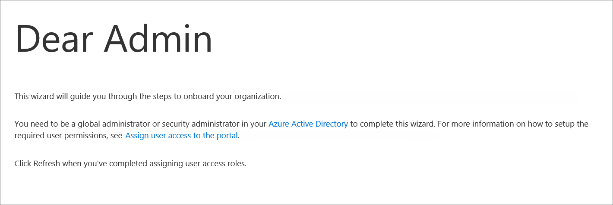
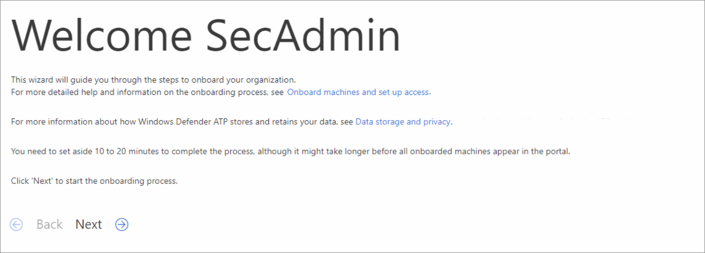
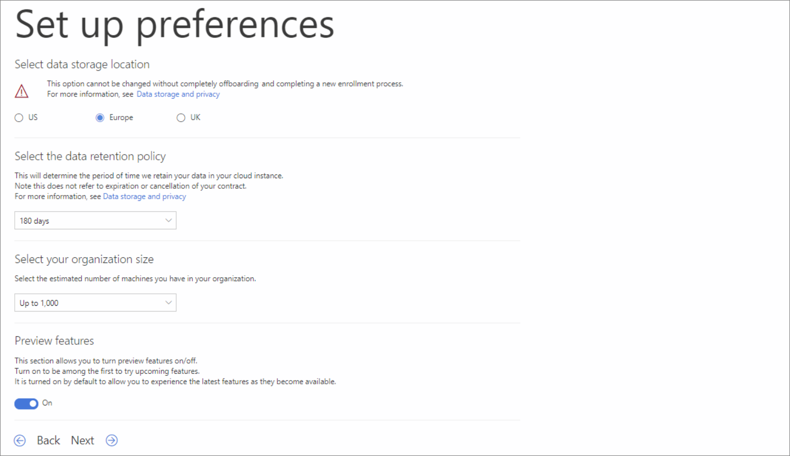
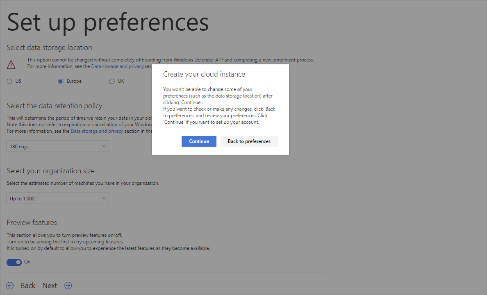
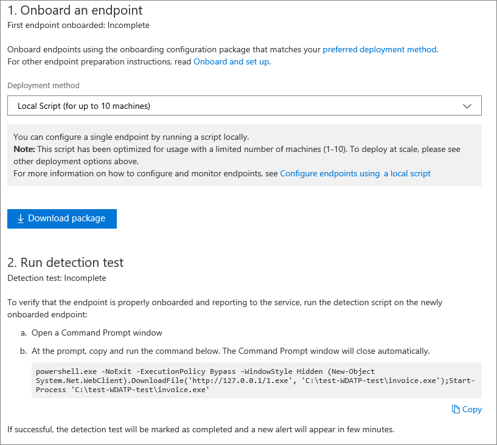
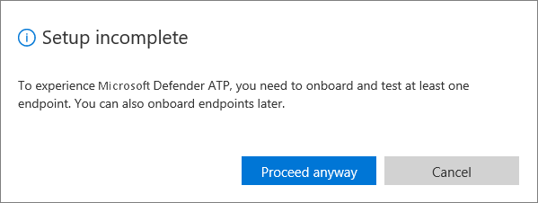

# Validate licensing provisioning and complete set up for Microsoft Defender ATP

**Applies to:**

- [Microsoft Defender Advanced Threat Protection (Microsoft Defender ATP)](https://go.microsoft.com/fwlink/p/?linkid=2069559)

>Want to experience Microsoft Defender ATP? [Sign up for a free trial.](https://www.microsoft.com/microsoft-365/windows/microsoft-defender-atp?ocid=docs-wdatp-validatelicense-abovefoldlink)

## Check license state

Checking for the license state and whether it got properly provisioned, can be done through the admin center or through the **Microsoft Azure portal**.

1. To view your licenses go to the **Microsoft Azure portal** and navigate to the [Microsoft Azure portal license section](https://portal.azure.com/#blade/Microsoft_AAD_IAM/LicensesMenuBlade/Products).

   

1. Alternately, in the admin center, navigate to **Billing** > **Subscriptions**.

   - On the screen you will see all the provisioned licenses and their current **Status**.

   

## Cloud Service Provider validation

To gain access into which licenses are provisioned to your company, and to check the state of the licenses, go to the admin center.

1. From the **Partner portal**, click on the **Administer services > Office 365**.

2. Clicking on the **Partner portal** link will leverage the **Admin on behalf** option and will give you access to the customer admin center.

   

## Access Microsoft Defender Security Center for the first time

When accessing [Microsoft Defender Security Center](https://SecurityCenter.Windows.com) for the first time there will be a setup wizard that will guide you through some initial steps. At the end of the setup wizard there will be a dedicated cloud instance of Microsoft Defender ATP created.

1. Each time you access the portal you will need to validate that you are authorized to access the product. This **Set up your permissions** step will only be available if you are not currently authorized to access the product.

    

	Once the authorization step is completed, the **Welcome** screen will be displayed.

2. The **Welcome** screen will provide some details as to what is about to occur during the set up wizard.

    

	You will need to set up your preferences for Microsoft Defender Security Center.

3. Set up preferences
    
    

   1. **Select data storage location**   When onboarding the service for the first time, you can choose to store your data in the Microsoft Azure datacenters in the United States, the European Union, or the United Kingdom. Once configured, you cannot change the location where your data is stored. This provides a convenient way to minimize compliance risk by actively selecting the geographic locations where your data will reside. Microsoft will not transfer the data from the specified geolocation.

    	> [!WARNING]
    	> This option cannot be changed without completely offboarding from Microsoft Defender ATP and completing a new enrollment process.

   2. **Select the data retention policy**   Microsoft Defender ATP will store data up to a period of 6 months in your cloud instance, however, you have the option to set the data retention period for a shorter timeframe during this step of the set up process.

      > [!NOTE]
      > This option can be changed at a later time.

   3. **Select the size of your organization**   You will need to indicate the size of your organization based on an estimate of the number of employees currently employed.

      > [!NOTE]
      > The **organization size** question is not related to how many licenses were purchased for your organization. It is used by the service to optimize the creation of the data cluster for your organization.

   4. **Turn on preview features**   Learn about new features in the Microsoft Defender ATP preview release and be among the first to try upcoming features by turning on **Preview features**.

	    You'll have access to upcoming features which you can provide feedback on to help improve the overall experience before features are generally available.

      - Toggle the setting between On and Off to choose **Preview features**.

      > [!NOTE]
      > This option can be changed at a later time.

4. You will receive a warning notifying you that you won't be able to change some of your preferences once you click **Continue**.

	> [!NOTE]
	> Some of these options can be changed at a later time in Microsoft Defender Security Center.

    

5. A dedicated cloud instance of Microsoft Defender Security Center is being created at this time. This step will take an average of 5 minutes to complete.

6. You are almost done. Before you can start using Microsoft Defender ATP you'll need to:

   - [Onboard Windows 10 machines](configure-endpoints.md)

   - Run detection test (optional)

     

     > [!IMPORTANT]
     > If you click **Start using Microsoft Defender ATP** before onboarding machines you will receive the following notification:
     > 

7. After onboarding machines you can click **Start using Microsoft Defender ATP**. You will now launch Microsoft Defender ATP for the first time.

## Related topics
- [Onboard machines to the Microsoft Defender Advanced Threat Protection service](onboard-configure.md)
- [Troubleshoot onboarding process and portal access issues](troubleshoot-onboarding-error-messages.md)
