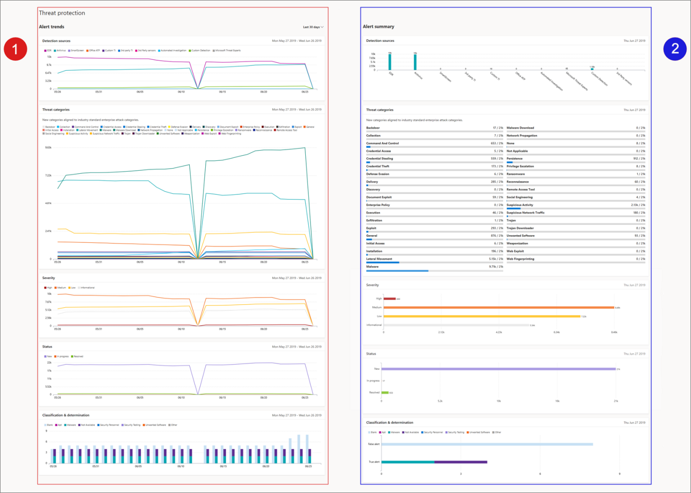

# Threat protection report in Microsoft Defender ATP

**Applies to:**
- [Microsoft Defender Advanced Threat Protection (Microsoft Defender ATP)](https://go.microsoft.com/fwlink/p/?linkid=2069559)

The threat protection report provides high-level information about alerts generated in your organization. The report includes trending information showing the detection sources, categories, severities, statuses, classifications, and determinations of alerts across time.

The dashboard is structured into two sections:

Section | Description 
:---|:---
1 | Alerts trends
2 | Alert summary

By default, the alert trends display alert information from the 30-day period ending in the latest full day. To gain better perspective on trends occurring in your organization, you can fine-tune the reporting period by adjusting the time period shown. To adjust the time period, select a time range from the drop-down options:

- 30 days
- 3 months
- 6 months
- Custom

While the alert trends shows trending alert information, the alert summary shows alert information scoped to the current day.

 The alert summary allows you to drill down to a particular alert queue with the corresponding filter applied to it. For example, clicking on the EDR bar in the Detection sources card will bring you the alerts queue with results showing only alerts generated from EDR detections. 

## Alert attributes
The report is made up of cards that display the following alert attributes:

- **Detection sources**: shows information about the sensors and detection technologies that provide the data used by Microsoft Defender ATP to trigger alerts.

- **Threat categories**: shows the types of threat or attack activity that triggered alerts, indicating possible focus areas for your security operations.

- **Severity**: shows the severity level of alerts, indicating the collective potential impact of threats to your organization and the level of response needed to address them.

- **Status**: shows the resolution status of alerts, indicating the efficiency of your manual alert responses and of automated remediation (if enabled). 

- **Classification & determination**: shows how you have classified alerts upon resolution, whether you have classified them as actual threats (true alerts) or as incorrect detections (false alerts). These cards also show the determination of resolved alerts, providing additional insight like the types of actual threats found or the legitimate activities that were incorrectly detected.

 

## Filter data

Use the provided filters to include or exclude alerts with certain attributes.

>[!NOTE]
>These filters apply to **all** the cards in the report.

For example, to show data about high-severity alerts only:

1. Under **Filters > Severity**, select **High**
2. Ensure that all other options under **Severity** are deselected.
3. Select **Apply**. 

## Related topic
- [Machine health and compliance report](machine-reports.md)